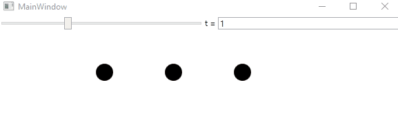
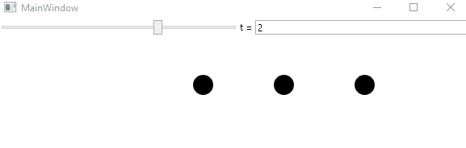

# INT_3403_20_WPF
Bài tập chương 5 sách "Computer graphics principles and practice".

## Exercises 5-1
> Write a program that displays an image consisting of parallel stripes, sitting above another image that’s pure gray. Make the gray level adjustable (by slider, buttons, keystrokes, or any other means you like). Stand far enough away that the stripes are indistinguishable from one another,and adjust(or have a friend adjust) the gray level of the solid rectangle until you say it matches the apparent gray of the stripes. Now move toward the display screen until you can detect the stripes individually; measure your distance from the display, and compute the angle subtended at your eye by a pair of parallel stripes. You should make sure that you’re not fooling yourself by having the display(after the press/click of a button) show either vertical or horizontal stripes next to the gray rectangle (at random) and have the position of the stripes and the solid rectangle exchanged or not (at random).

**Preview:**

## Exercises 5-2
> Implement the motion-induced-blindness experiment; include buttons to increase/decrease the speed of rotation and the size of the “disappearing” dots, and allow the user to choose the color of the grid and the dots. Experiment with which colors work best at making the dots disappear.

**Preview:**

## Exercises 5-3
> Write a program that draws three black dots of radius 0.25 at x = 0,1,2 along the x-axis. Then display instead three black dots at positions t,t + 1, and t + 2 (usingt = 0.25 initially). Make the display toggle back and forth between the two sets of dots, once every quarter-second. Do you tend to see the dots as moving? What if you increase t to 0.5? Include a slider that lets you adjust t from 0 to 3. Does the illusion of the dots moving ever weaken? When t = 1, you could interpret the motion as “the outer dot jumps back and forth from the far left(x = 0)to the far right (x = 3) while the middle two dots remain fixed.” Can you persuade yourself that this is what you’re seeing? The strong impression that the dots are moving as a group is remarkably hard to abandon, supporting the Gestalt theory. 

**Preview:**

## Exercises 5-4
>  Write a program to imitate Figure 5.13, where a slider controls the position of the red ball along its trajectory. Include a set of radio buttons that lets you change the “shadow” of the ball from an ellipse to a disk to a square to a small airplane shape, and see how the change affects your perception of the red ball’s position. You can write the program using the 3D test bed or the 2D test bed—there’s no particular need to get the perspective projection exactly right, so merely mimicking the figure will suffice.

**Preview:**

